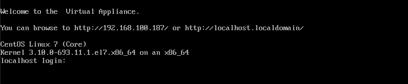

## Get Started

When to use ManageIQ in production environment, users normally download virtual appliances and deploy onto virtualization platform like OpenStack or VMware.

For getting started with ManageIQ, it is also available as vagrant Box or Docker image. These are simpler ways to know ManageIQ.

For this guide, we will launch ManageIQ VM using QEmu/KVM. It is then configured to connect to virtulization platform so that it can be managed. We will discuss this in next chapter.

Let's get started for setup. For this, we require ManageIQ appliance which is available on ManageIQ site. First [download virtual appliance](http://manageiq.org/download/) for **QEmu/KVM**. We will get `qc2` format disk which we use to launch VM.

| Note | Ansible automation feature is supported since ManageIQ Fine releases. It is suggested to download release after Fine version. |
|------|:------|

### Launch ManageIQ appliance

Create a new virtual machine using downloaded disk image. It is recommend that it should have minimum _8GB RAM_ and _4 vCPU_.

Once the appliance is booted successfully, we get this screen:

Log in using default credentials

- **Login:** root  
- **Password:** smartvm

Now we have access of appliance console to configure and control ManageIQ server.

