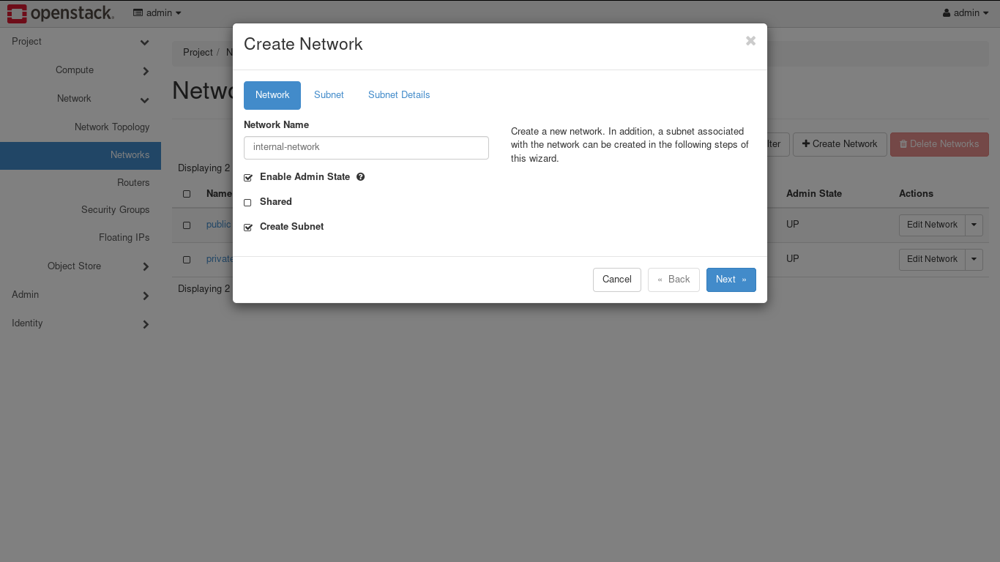
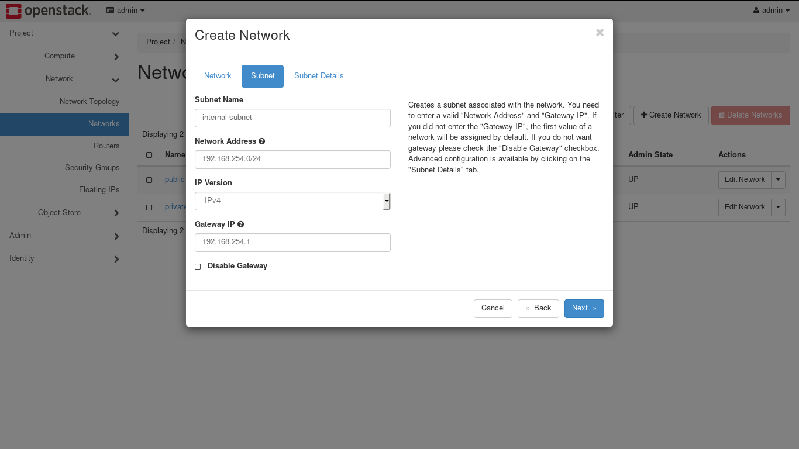
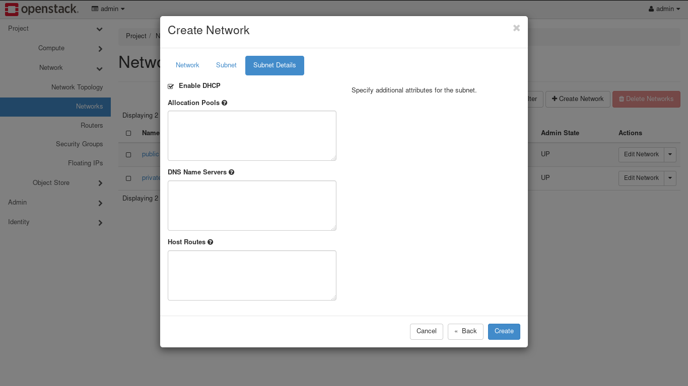
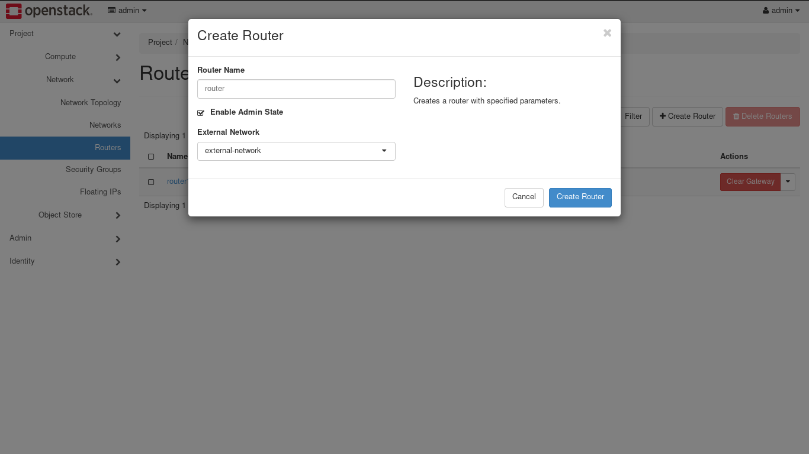
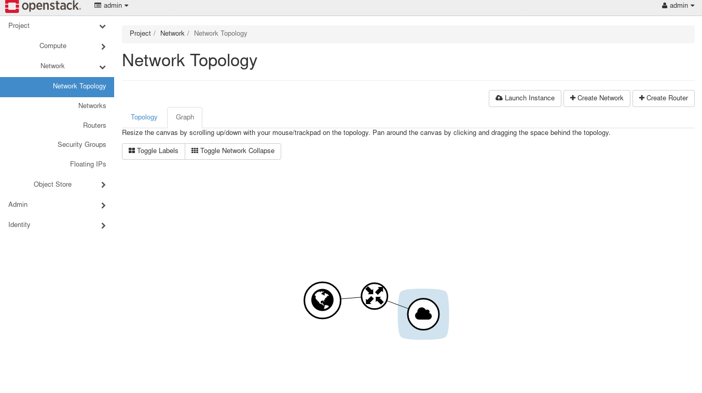

Once the installation of OpenStack is done, we need to configure OpenStack Network to enable access to it's instances.

## Configure OpenStack Network

Login into OpenStack dashboard using admin credentials. Go to **Project &rarr; Networks.** While on this page, hit on **Create Network** button and setup internal network as follows:

Next, use the above steps to create external network. Make sure that IP address for external network is in same network range as your compute node IP address range.

On the next step, we need to mark external network as External. To do this, Navigate to **Admin &rarr; Networks** then while editing external network that we created, check External Network option. This is required in order to communicate with instances.

### Create Router

We need to create router to communicate between two networks. Go to **Project &rarr; Network &rarr; Routers** and click on Create Router.r

Once router has been created, go to interface of that router and click on Add Interface. Select internal network and hit on Submit. We can see the whole network map in **Project &rarr; Network &rarr; Network Topology.**

## OpenStack Configuration

OpenStack uses ini format for configuration files.
