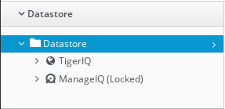
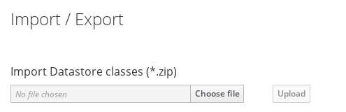
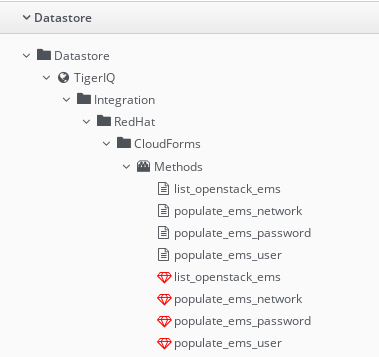

## Domain

A domain is a collection of namespaces, classes, instances and methods.
ManageIQ ship with single domain called ManageIQ. It is in locked state
which means it is read-only.

To explore Datastores present in ManageIQ, navigate to **Automation
&rarr; Automate &rarr; Explorer**. When on the page, click on Datastores
to get list of available domains in ManageIQ.



Custom domain can be added by user (TigerIQ is user-added domain).
User-added domains can be enabled or disabled. User can import and
export domains, which we will see further.

### Domain Priority

To prioritize user-added domains, select Datastores and click
**Configuration &rarr; Edit Priority order of Domains**. Then we get
options to prioritize domains.


| Note | Make sure that domain is at highest priority to use it. |
|------|:-------|

### Domain Export

An automate domain can be exported into a directory or a zip file.

To export domain into directory, use the following command,
```
# rake evm:automate:export DOMAIN=<domain_name> EXPORT_DIR=<export_path>
```

To export domain into a zip file, use the following,
```
# rake evm:automate:export DOMAIN=<domain_name> ZIP_FILE=<file_name.zip>
```

| Tip | For this, import/export script is available. This can be installed on appliance following instructions on https://github.com/rhtconsulting/cfme-rhconsulting-scripts |
|-----|:------|

### Domain Import

It is possible to import domain into a new domain. Domain can be
imported from a directory or from a zip file.

To import domain from a directory use the following,
```
rake evm:automate:import DOMAIN=<domain_name> IMPORT_DIR=<path> PREVIEW=false
```

To import domain from a zip file,
```
rake evm:automate:import DOMAIN=<domain_name> ZIP_FILE=<file.zip> PREVIEW=false
```

| Note | After importing domain, check whether it is enabled or not. Domain must be enabled to use it. |
|------|:------|

Also we can import Datastore classes as zip file from manageIQ web
portal itself. To do this, Go to **Automation &rarr; Automate &rarr;
Import/Export**.



## Namespaces

Namespace contain classes, methods and sometime other namespaces. One
such example of namespace is shown in following figure:



